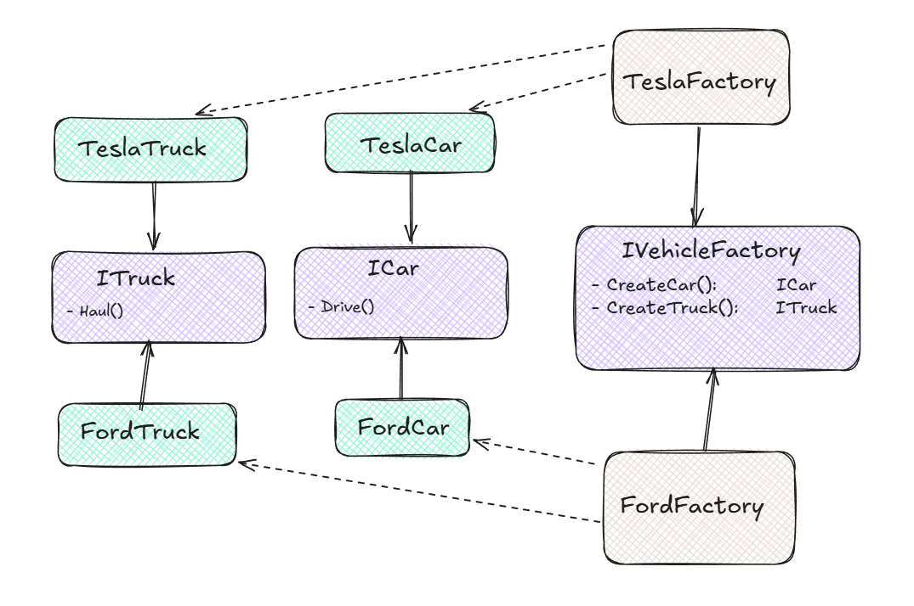

# Abstract Factory Pattern - Vehicle Manufacturing System

## Problem Description
You are building a vehicle manufacturing system that produces different types of vehicles (e.g., **cars** and **trucks**) for two brands: **Tesla** and **Ford**. Each brand has its own design and specifications for these vehicles. Your task is to design a system that can create a consistent set of vehicles for a specific brand without tightly coupling the client code to the concrete implementations.

## Solution
The **Abstract Factory Pattern** is used to create families of related or dependent objects without specifying their concrete classes. In this case, we define an abstract factory (`IVehicleFactory`) and concrete factories (`TeslaFactory`, `FordFactory`) to create brand-specific vehicles.

